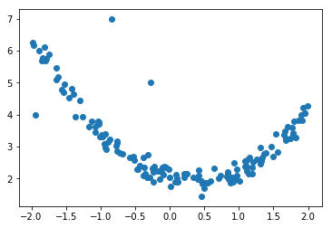
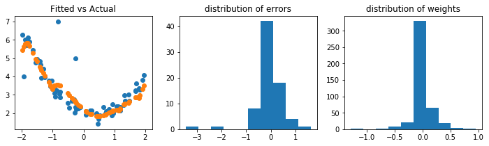

```python
import numpy as np
import tensorflow as tf
from matplotlib import pyplot as plt
%matplotlib inline
```

Generate pseudo-data


```python
n = 150
np.random.seed(110104)
x = 4.0 * (np.random.rand(n) - 0.5)
xfeat = np.column_stack((x**i for i in range(1, 9))) # polynomials up to degree 8
y = 2.0 - 0.2*x + 0.2*(2*x - 0.5)**2 + 0.2 * np.random.randn(n)
y[2] = 4.0 # Artificial outliers
y[3] = 7.0 # Artificial outliers
y[10] = 5.0 # Artificial outliers
y = y.reshape((n, 1))

plt.scatter(x, y)
```


    <matplotlib.collections.PathCollection at 0x22327de6e48>





Let's split data in test and train (we'll use only train for Bayesian evidence and test for cross-validation)


```python
n_train = 75
xfeat_train, y_train = xfeat[:n_train, :], y[:n_train, :]
xfeat_test, y_test = xfeat[n_train:, :], y[n_train:, :]
```

This is a function to generate training batches


```python
def get_batches(xfeat, y, batch_size):
    n_batches = xfeat.shape[0] // batch_size
    for i in range(n_batches):
        yield xfeat[i*batch_size:(i + 1)*batch_size,:], y[i*batch_size:(i + 1)*batch_size,:]
```

Create a very simple architecture with one hidden and a l2 regulariser


```python
def nn_input(dim_features, dim_output):
    features = tf.placeholder(tf.float32, (None, dim_features))
    target = tf.placeholder(tf.float32, (None, dim_output))
    lr = tf.placeholder(tf.float32)
    penalty = tf.placeholder(tf.float32)
    precision = tf.placeholder(tf.float32)
    return features, target, lr, penalty, precision
    
def hidden_layer(features, dim_features, dim_hidden):
    # The weights are created as a vector so that taking hessian is easier
    W = tf.Variable(tf.truncated_normal((dim_features*dim_hidden, ), stddev=1/np.sqrt(dim_features*dim_hidden)))
    Wmat = tf.reshape(W, (dim_features, dim_hidden))
    b = tf.Variable(tf.zeros(dim_hidden))
    hidden = tf.nn.relu(tf.matmul(features, Wmat) + b)
    return hidden, W, b

def output_layer(hidden, dim_hidden, dim_output):
    # The weights are created as a vector so that taking hessian is easier
    W2 = tf.Variable(tf.truncated_normal((dim_hidden*dim_output, ), stddev=1/np.sqrt(dim_hidden*dim_output)))
    W2mat = tf.reshape(W2, (dim_hidden, dim_output))
    b2 = tf.Variable(tf.zeros(1))
    output = tf.matmul(hidden, W2mat) + b2
    return output, W2, b2

def nn_loss(output, target, penalty, precision, W, W2):
    errors = output - target
    weights = tf.concat([W, W2], axis = 0)
    loss = precision * tf.reduce_sum(tf.square(errors)) + penalty * tf.reduce_sum(tf.square(weights))
    return loss, errors, weights

def nn_optimization(loss, lr):
    optim = tf.train.AdamOptimizer(lr).minimize(loss)
    return optim
    
class neural_network():
    def __init__(self, dim_features, dim_output, dim_hidden):
        self.features, self.target, self.lr, self.penalty, self.precision = nn_input(dim_features, dim_output)
        self.hidden, self.W, self.b = hidden_layer(self.features, dim_features, dim_hidden)
        self.output, self.W2, self.b2 = output_layer(self.hidden, dim_hidden, dim_output)
        self.loss, self.errors, self.weights = nn_loss(
            self.output, self.target, self.penalty, self.precision, self.W, self.W2)
        self.optim = nn_optimization(self.loss, self.lr)
        self.hessian = tf.hessians(self.loss, [self.W, self.W2])[0] # Jesus! Hessians!
```

Now create the neural network


```python
dim_features = xfeat_train.shape[1]
dim_output = y_train.shape[1]
dim_hidden = 50

tf.reset_default_graph()
nn = neural_network(dim_features, dim_output, dim_hidden) # Takes some time to create just because there is a hessian!
nn.__dict__
```


    {'W': <tf.Variable 'Variable:0' shape=(400,) dtype=float32_ref>,
     'W2': <tf.Variable 'Variable_2:0' shape=(50,) dtype=float32_ref>,
     'b': <tf.Variable 'Variable_1:0' shape=(50,) dtype=float32_ref>,
     'b2': <tf.Variable 'Variable_3:0' shape=(1,) dtype=float32_ref>,
     'errors': <tf.Tensor 'sub:0' shape=(?, 1) dtype=float32>,
     'features': <tf.Tensor 'Placeholder:0' shape=(?, 8) dtype=float32>,
     'hessian': <tf.Tensor 'TensorArrayStack/TensorArrayGatherV3:0' shape=(?, 400) dtype=float32>,
     'hidden': <tf.Tensor 'Relu:0' shape=(?, 50) dtype=float32>,
     'loss': <tf.Tensor 'add_2:0' shape=<unknown> dtype=float32>,
     'lr': <tf.Tensor 'Placeholder_2:0' shape=<unknown> dtype=float32>,
     'optim': <tf.Operation 'Adam' type=NoOp>,
     'output': <tf.Tensor 'add_1:0' shape=(?, 1) dtype=float32>,
     'penalty': <tf.Tensor 'Placeholder_3:0' shape=<unknown> dtype=float32>,
     'precision': <tf.Tensor 'Placeholder_4:0' shape=<unknown> dtype=float32>,
     'target': <tf.Tensor 'Placeholder_1:0' shape=(?, 1) dtype=float32>,
     'weights': <tf.Tensor 'concat:0' shape=(450,) dtype=float32>}


We now train and evaluate the network


```python
epochs = 500
print_every_epochs = 50
batch_size = 10
lr = 0.01
penalty = 0.00000001
precision = 25.0 # because we use noise with sigma = 0.2

hyperparams= {nn.penalty: penalty, nn.precision: precision, nn.lr: lr}
full_training_feed = {nn.features: xfeat_train, nn.target: y_train, **hyperparams}

with tf.Session() as sess:
    # Training
    sess.run(tf.global_variables_initializer())
 
    for epoch in range(epochs):
        for batch_x, batch_y in get_batches(xfeat_train, y_train, batch_size):
            batch_feed = {nn.features: batch_x, nn.target: batch_y, **hyperparams}
            sess.run(nn.optim, batch_feed)
        if epoch == 0 or (epoch  + 1) % print_every_epochs == 0:
            loss = sess.run(nn.loss, full_training_feed)
            print("epoch %2d training loss %4.4f" % (epoch + 1, loss))

    # Visualize fit, errors, and weights
    errors, weights, output = sess.run([nn.errors, nn.weights, nn.output], full_training_feed)
    fig, (ax0, ax1, ax2) = plt.subplots(1, 3, figsize = (12, 3))
    ax0.scatter(xfeat_train[:,0], y_train)
    ax0.scatter(xfeat_train[:,0], output)
    ax0.set_title('Fitted vs Actual')
    ax1.hist(errors)
    ax1.set_title('distribution of errors')
    ax2.hist(weights)
    ax2.set_title("distribution of weights")
```

    epoch  1 training loss 33981.3984
    epoch 50 training loss 712.9588
    epoch 100 training loss 677.3344
    epoch 150 training loss 720.5264
    epoch 200 training loss 699.6487
    epoch 250 training loss 714.2664
    epoch 300 training loss 699.9774
    epoch 350 training loss 696.7038
    epoch 400 training loss 688.4408
    epoch 450 training loss 690.7779
    epoch 500 training loss 690.3386
    





Let's repeat this but with Bayesian evidence!


```python
def log_evidence(hessian, loss, penalty, precision, dim_hidden, n_obs, n_weights):
    s, logdet = np.linalg.slogdet(hessian)
    N, k = n_obs, n_weights
    posterior_energy = -0.5 * loss + 0.5 * k * np.log(2*np.pi) - 0.5 * logdet
    weights_energy = 0.5 * k * np.log(2 * np.pi / penalty) 
    model_energy = 0.5 * N * np.log(2 * np.pi / precision)
    symmetry_factor = dim_hidden * np.log(2) + np.sum(np.log(np.arange(1, dim_hidden + 1)))
    return symmetry_factor + posterior_energy - weights_energy - model_energy
```


```python
def test_nn(
        xfeat_train, y_train,
        xfeat_test, y_test,
        dim_hidden, 
        epochs,
        batch_size,
        lr,
        penalty,
        precision): 
    # Create network
    dim_features = xfeat.shape[1]
    dim_output = y.shape[1]
    tf.reset_default_graph()
    nn = neural_network(dim_features, dim_output, dim_hidden) # Takes some time to create just because there is a hessian!
    # Feed dictionaries
    hyperparams= {nn.penalty: penalty, nn.precision: precision, nn.lr: lr}
    with tf.Session() as sess:
        # Train
        sess.run(tf.global_variables_initializer())
        for epoch in range(epochs):
            for batch_x, batch_y in get_batches(xfeat_train, y_train, batch_size):
                batch_feed = {nn.features: batch_x, nn.target: batch_y, nn.lr: lr, **hyperparams}
                sess.run(nn.optim, batch_feed)
        # Find Bayesian (Log)evidence
        full_train_feed = {nn.features: xfeat_train, nn.target: y_train, **hyperparams}
        full_test_feed = {nn.features: xfeat_test, nn.target: y_test, **hyperparams}
        hessian, loss_train, output, weights = sess.run([nn.hessian, nn.loss, nn.output, nn.weights], full_train_feed)
        evidence = log_evidence(hessian, loss_train, penalty, precision, dim_hidden, len(output), len(weights)) 
        loss_test = sess.run(nn.loss, full_test_feed)
        return evidence, loss_train, loss_test
```

Test and compare evidence for multiple precisions and noises


```python
# Optimization parameters
epochs = 500
batch_size = 10
lr = 0.01
attempts_per_setting = 3

# Network parameters
dim_hidden_list = [2, 5, 10, 25, 50, 100]
penalty_list = [0.00000001, .00001, 0.0001, 0.001, 0.01, 0.1, 1.0, 10.0, 100.0]
precision = 25.0

evidence_trace = []
generror_trace = []
for dim_hidden in dim_hidden_list:   
    dim_av_evidence = 0
    for penalty in penalty_list:     
        for attempt in range(attempts_per_setting):
            bayes_train, loss_train, loss_test = test_nn(
                xfeat_train, y_train, xfeat_test, y_test, dim_hidden, epochs, batch_size, lr, penalty, precision)
            evidence_trace.append(bayes_train)
            generror_trace.append(loss_test)
            print_str = 'hidden dim: %4d  penalty: %14.8f evidence: %9.2f' + \
                ' train loss: %9.2f test loss: %9.2f  attempt: %d'
            dim_av_evidence += bayes_train / len(penalty_list) / attempts_per_setting
            print(print_str %(dim_hidden, penalty, bayes_train, loss_train, loss_test, attempt + 1))
    print('Average evidence for %d hidden variables is %0.2f' % (dim_hidden, dim_av_evidence))
```

    hidden dim:    2  penalty:     0.00000001 evidence:   -410.43 train loss:    697.15 test loss:    136.79  attempt: 1
    hidden dim:    2  penalty:     0.00000001 evidence:   -410.16 train loss:    682.22 test loss:    141.81  attempt: 2
    hidden dim:    2  penalty:     0.00000001 evidence:   -485.08 train loss:    707.83 test loss:    334.14  attempt: 3
    hidden dim:    2  penalty:     0.00001000 evidence:   -414.18 train loss:    687.78 test loss:    141.21  attempt: 1
    hidden dim:    2  penalty:     0.00001000 evidence:   -417.13 train loss:    673.55 test loss:    161.87  attempt: 2
    hidden dim:    2  penalty:     0.00001000 evidence:   -376.52 train loss:    686.33 test loss:    136.02  attempt: 3
    hidden dim:    2  penalty:     0.00010000 evidence:   -925.07 train loss:   1729.56 test loss:    716.76  attempt: 1
    hidden dim:    2  penalty:     0.00010000 evidence:   -410.20 train loss:    722.38 test loss:    160.95  attempt: 2
    hidden dim:    2  penalty:     0.00010000 evidence:  -1526.38 train loss:   3130.97 test loss:   2026.06  attempt: 3
    hidden dim:    2  penalty:     0.00100000 evidence:   -349.43 train loss:    684.87 test loss:    136.48  attempt: 1
    hidden dim:    2  penalty:     0.00100000 evidence:   -386.89 train loss:    686.46 test loss:    156.80  attempt: 2
    hidden dim:    2  penalty:     0.00100000 evidence:   -353.62 train loss:    686.22 test loss:    141.28  attempt: 3
    hidden dim:    2  penalty:     0.01000000 evidence:   -355.71 train loss:    684.91 test loss:    154.45  attempt: 1
    hidden dim:    2  penalty:     0.01000000 evidence:   -353.95 train loss:    706.90 test loss:    184.03  attempt: 2
    hidden dim:    2  penalty:     0.01000000 evidence:   -476.05 train loss:    989.64 test loss:    760.51  attempt: 3
    hidden dim:    2  penalty:     0.10000000 evidence:   -551.24 train loss:   1116.97 test loss:    584.01  attempt: 1
    hidden dim:    2  penalty:     0.10000000 evidence:   -466.57 train loss:    989.26 test loss:    760.15  attempt: 2
    hidden dim:    2  penalty:     0.10000000 evidence:   -468.77 train loss:    977.17 test loss:    798.52  attempt: 3
    hidden dim:    2  penalty:     1.00000000 evidence:   -328.33 train loss:    690.50 test loss:    150.66  attempt: 1
    hidden dim:    2  penalty:     1.00000000 evidence:   -463.82 train loss:    984.07 test loss:    763.56  attempt: 2
    hidden dim:    2  penalty:     1.00000000 evidence:   -331.36 train loss:    710.23 test loss:    121.56  attempt: 3
    hidden dim:    2  penalty:    10.00000000 evidence:   -342.62 train loss:    747.39 test loss:    156.13  attempt: 1
    hidden dim:    2  penalty:    10.00000000 evidence:   -348.12 train loss:    759.06 test loss:    164.82  attempt: 2
    hidden dim:    2  penalty:    10.00000000 evidence:   -369.33 train loss:    806.05 test loss:    180.69  attempt: 3
    hidden dim:    2  penalty:   100.00000000 evidence:  -1506.22 train loss:   3108.87 test loss:   1879.87  attempt: 1
    hidden dim:    2  penalty:   100.00000000 evidence:   -548.58 train loss:   1177.86 test loss:    530.46  attempt: 2
    hidden dim:    2  penalty:   100.00000000 evidence:   -461.04 train loss:    994.89 test loss:    288.78  attempt: 3
    Average evidence for 2 hidden variables is -512.47
    hidden dim:    5  penalty:     0.00000001 evidence:   -571.14 train loss:    676.64 test loss:    194.72  attempt: 1
    hidden dim:    5  penalty:     0.00000001 evidence:   -523.65 train loss:    742.48 test loss:    161.41  attempt: 2
    hidden dim:    5  penalty:     0.00000001 evidence:   -622.62 train loss:    662.99 test loss:    244.57  attempt: 3
    hidden dim:    5  penalty:     0.00001000 evidence:   -454.13 train loss:    678.58 test loss:    138.91  attempt: 1
    hidden dim:    5  penalty:     0.00001000 evidence:   -452.27 train loss:    672.15 test loss:    137.96  attempt: 2
    hidden dim:    5  penalty:     0.00001000 evidence:   -458.01 train loss:    649.91 test loss:    215.10  attempt: 3
    hidden dim:    5  penalty:     0.00010000 evidence:   -426.56 train loss:    713.53 test loss:    146.79  attempt: 1
    hidden dim:    5  penalty:     0.00010000 evidence:   -428.65 train loss:    638.66 test loss:    221.40  attempt: 2
    hidden dim:    5  penalty:     0.00010000 evidence:   -435.54 train loss:    650.53 test loss:    210.84  attempt: 3
    hidden dim:    5  penalty:     0.00100000 evidence:   -426.49 train loss:    667.17 test loss:    248.55  attempt: 1
    hidden dim:    5  penalty:     0.00100000 evidence:   -377.23 train loss:    661.12 test loss:    201.18  attempt: 2
    hidden dim:    5  penalty:     0.00100000 evidence:   -428.10 train loss:    643.34 test loss:    248.62  attempt: 3
    hidden dim:    5  penalty:     0.01000000 evidence:   -394.60 train loss:    682.38 test loss:    251.65  attempt: 1
    hidden dim:    5  penalty:     0.01000000 evidence:   -407.69 train loss:    732.90 test loss:    142.98  attempt: 2
    hidden dim:    5  penalty:     0.01000000 evidence:   -373.23 train loss:    658.39 test loss:    190.94  attempt: 3
    hidden dim:    5  penalty:     0.10000000 evidence:   -367.16 train loss:    714.54 test loss:    373.73  attempt: 1
    hidden dim:    5  penalty:     0.10000000 evidence:   -346.99 train loss:    668.37 test loss:    157.80  attempt: 2
    hidden dim:    5  penalty:     0.10000000 evidence:   -358.06 train loss:    703.60 test loss:    131.42  attempt: 3
    hidden dim:    5  penalty:     1.00000000 evidence:   -324.68 train loss:    669.10 test loss:    169.08  attempt: 1
    hidden dim:    5  penalty:     1.00000000 evidence:   -349.76 train loss:    707.50 test loss:    212.75  attempt: 2
    hidden dim:    5  penalty:     1.00000000 evidence:   -336.08 train loss:    670.47 test loss:    136.77  attempt: 3
    hidden dim:    5  penalty:    10.00000000 evidence:   -349.05 train loss:    748.04 test loss:    193.74  attempt: 1
    hidden dim:    5  penalty:    10.00000000 evidence:   -403.11 train loss:    851.35 test loss:    443.48  attempt: 2
    hidden dim:    5  penalty:    10.00000000 evidence:   -382.39 train loss:    796.21 test loss:    234.22  attempt: 3
    hidden dim:    5  penalty:   100.00000000 evidence:   -457.71 train loss:   1003.13 test loss:    316.51  attempt: 1
    hidden dim:    5  penalty:   100.00000000 evidence:   -437.75 train loss:    966.25 test loss:    306.02  attempt: 2
    hidden dim:    5  penalty:   100.00000000 evidence:   -461.99 train loss:   1008.32 test loss:    307.77  attempt: 3
    Average evidence for 5 hidden variables is -420.54
    hidden dim:   10  penalty:     0.00000001 evidence:   -747.71 train loss:    667.07 test loss:    226.52  attempt: 1
    hidden dim:   10  penalty:     0.00000001 evidence:   -614.89 train loss:    688.17 test loss:    138.35  attempt: 2
    hidden dim:   10  penalty:     0.00000001 evidence:   -833.53 train loss:    664.23 test loss:    198.62  attempt: 3
    hidden dim:   10  penalty:     0.00001000 evidence:   -565.36 train loss:    659.41 test loss:    252.62  attempt: 1
    hidden dim:   10  penalty:     0.00001000 evidence:   -534.16 train loss:    697.19 test loss:    215.57  attempt: 2
    hidden dim:   10  penalty:     0.00001000 evidence:   -551.34 train loss:    675.55 test loss:    220.54  attempt: 3
    hidden dim:   10  penalty:     0.00010000 evidence:   -472.96 train loss:    651.63 test loss:    199.91  attempt: 1
    hidden dim:   10  penalty:     0.00010000 evidence:   -495.40 train loss:    686.86 test loss:    246.35  attempt: 2
    hidden dim:   10  penalty:     0.00010000 evidence:   -522.41 train loss:    692.92 test loss:    371.77  attempt: 3
    hidden dim:   10  penalty:     0.00100000 evidence:   -473.58 train loss:    679.15 test loss:    243.30  attempt: 1
    hidden dim:   10  penalty:     0.00100000 evidence:   -611.62 train loss:   1052.82 test loss:    504.89  attempt: 2
    hidden dim:   10  penalty:     0.00100000 evidence:   -458.09 train loss:    686.31 test loss:    243.93  attempt: 3
    hidden dim:   10  penalty:     0.01000000 evidence:   -392.87 train loss:    648.54 test loss:    186.13  attempt: 1
    hidden dim:   10  penalty:     0.01000000 evidence:   -409.63 train loss:    701.84 test loss:    164.77  attempt: 2
    hidden dim:   10  penalty:     0.01000000 evidence:   -402.22 train loss:    659.77 test loss:    259.71  attempt: 3
    hidden dim:   10  penalty:     0.10000000 evidence:   -360.79 train loss:    615.09 test loss:    228.24  attempt: 1
    hidden dim:   10  penalty:     0.10000000 evidence:   -381.58 train loss:    691.64 test loss:    184.15  attempt: 2
    hidden dim:   10  penalty:     0.10000000 evidence:   -383.36 train loss:    709.92 test loss:    286.94  attempt: 3
    hidden dim:   10  penalty:     1.00000000 evidence:   -335.04 train loss:    662.64 test loss:    176.89  attempt: 1
    hidden dim:   10  penalty:     1.00000000 evidence:   -334.42 train loss:    644.99 test loss:    196.69  attempt: 2
    hidden dim:   10  penalty:     1.00000000 evidence:   -371.24 train loss:    747.28 test loss:    162.53  attempt: 3
    hidden dim:   10  penalty:    10.00000000 evidence:   -424.56 train loss:    898.76 test loss:    219.15  attempt: 1
    hidden dim:   10  penalty:    10.00000000 evidence:   -386.02 train loss:    819.19 test loss:    229.81  attempt: 2
    hidden dim:   10  penalty:    10.00000000 evidence:   -368.61 train loss:    790.39 test loss:    270.86  attempt: 3
    hidden dim:   10  penalty:   100.00000000 evidence:   -437.74 train loss:    981.29 test loss:    270.98  attempt: 1
    hidden dim:   10  penalty:   100.00000000 evidence:   -466.87 train loss:   1035.62 test loss:    272.11  attempt: 2
    hidden dim:   10  penalty:   100.00000000 evidence:   -974.16 train loss:   2054.22 test loss:    951.34  attempt: 3
    Average evidence for 10 hidden variables is -492.97
    hidden dim:   25  penalty:     0.00000001 evidence:  -1046.63 train loss:    636.41 test loss:    221.02  attempt: 1
    hidden dim:   25  penalty:     0.00000001 evidence:  -1170.75 train loss:    684.68 test loss:    233.03  attempt: 2
    hidden dim:   25  penalty:     0.00000001 evidence:   -941.86 train loss:    650.21 test loss:    211.76  attempt: 3
    hidden dim:   25  penalty:     0.00001000 evidence:   -720.12 train loss:    654.71 test loss:    252.59  attempt: 1
    hidden dim:   25  penalty:     0.00001000 evidence:   -666.54 train loss:    660.08 test loss:    241.07  attempt: 2
    hidden dim:   25  penalty:     0.00001000 evidence:   -723.21 train loss:    703.16 test loss:    224.59  attempt: 3
    hidden dim:   25  penalty:     0.00010000 evidence:   -627.44 train loss:    666.15 test loss:    272.98  attempt: 1
    hidden dim:   25  penalty:     0.00010000 evidence:   -633.23 train loss:    745.32 test loss:    233.71  attempt: 2
    hidden dim:   25  penalty:     0.00010000 evidence:   -594.50 train loss:    662.71 test loss:    210.75  attempt: 3
    hidden dim:   25  penalty:     0.00100000 evidence:   -508.60 train loss:    581.97 test loss:    173.21  attempt: 1
    hidden dim:   25  penalty:     0.00100000 evidence:   -527.05 train loss:    634.70 test loss:    262.10  attempt: 2
    hidden dim:   25  penalty:     0.00100000 evidence:   -529.98 train loss:    692.04 test loss:    234.03  attempt: 3
    hidden dim:   25  penalty:     0.01000000 evidence:   -456.48 train loss:    673.55 test loss:    287.84  attempt: 1
    hidden dim:   25  penalty:     0.01000000 evidence:   -475.60 train loss:    686.52 test loss:    229.87  attempt: 2
    hidden dim:   25  penalty:     0.01000000 evidence:   -433.87 train loss:    650.94 test loss:    216.15  attempt: 3
    hidden dim:   25  penalty:     0.10000000 evidence:   -388.53 train loss:    627.24 test loss:    234.92  attempt: 1
    hidden dim:   25  penalty:     0.10000000 evidence:   -386.11 train loss:    642.00 test loss:    233.92  attempt: 2
    hidden dim:   25  penalty:     0.10000000 evidence:   -391.60 train loss:    665.98 test loss:    189.90  attempt: 3
    hidden dim:   25  penalty:     1.00000000 evidence:   -354.09 train loss:    701.68 test loss:    199.17  attempt: 1
    hidden dim:   25  penalty:     1.00000000 evidence:   -367.89 train loss:    716.33 test loss:    237.04  attempt: 2
    hidden dim:   25  penalty:     1.00000000 evidence:   -354.47 train loss:    674.46 test loss:    242.29  attempt: 3
    hidden dim:   25  penalty:    10.00000000 evidence:   -349.85 train loss:    793.11 test loss:    160.39  attempt: 1
    hidden dim:   25  penalty:    10.00000000 evidence:   -309.94 train loss:    709.82 test loss:    176.34  attempt: 2
    hidden dim:   25  penalty:    10.00000000 evidence:   -378.15 train loss:    863.84 test loss:    207.01  attempt: 3
    hidden dim:   25  penalty:   100.00000000 evidence:   -410.26 train loss:   1019.32 test loss:    295.97  attempt: 1
    hidden dim:   25  penalty:   100.00000000 evidence:   -410.05 train loss:   1018.05 test loss:    269.98  attempt: 2
    hidden dim:   25  penalty:   100.00000000 evidence:   -397.64 train loss:    992.24 test loss:    267.99  attempt: 3
    Average evidence for 25 hidden variables is -539.05
    hidden dim:   50  penalty:     0.00000001 evidence:  -1704.39 train loss:    723.79 test loss:    392.26  attempt: 1
    hidden dim:   50  penalty:     0.00000001 evidence:  -1631.82 train loss:    643.83 test loss:    212.17  attempt: 2
    hidden dim:   50  penalty:     0.00000001 evidence:  -1784.17 train loss:    630.52 test loss:    290.16  attempt: 3
    hidden dim:   50  penalty:     0.00001000 evidence:   -856.48 train loss:    668.85 test loss:    261.11  attempt: 1
    hidden dim:   50  penalty:     0.00001000 evidence:   -883.52 train loss:    661.78 test loss:    248.13  attempt: 2
    hidden dim:   50  penalty:     0.00001000 evidence:   -852.67 train loss:    616.83 test loss:    230.32  attempt: 3
    hidden dim:   50  penalty:     0.00010000 evidence:   -692.59 train loss:    582.93 test loss:    199.78  attempt: 1
    hidden dim:   50  penalty:     0.00010000 evidence:   -701.51 train loss:    642.49 test loss:    222.48  attempt: 2
    hidden dim:   50  penalty:     0.00010000 evidence:   -721.21 train loss:    610.40 test loss:    234.45  attempt: 3
    hidden dim:   50  penalty:     0.00100000 evidence:   -588.53 train loss:    680.88 test loss:    230.86  attempt: 1
    hidden dim:   50  penalty:     0.00100000 evidence:   -568.83 train loss:    647.41 test loss:    219.04  attempt: 2
    hidden dim:   50  penalty:     0.00100000 evidence:   -574.65 train loss:    627.74 test loss:    205.14  attempt: 3
    hidden dim:   50  penalty:     0.01000000 evidence:   -474.52 train loss:    564.83 test loss:    201.53  attempt: 1
    hidden dim:   50  penalty:     0.01000000 evidence:   -492.43 train loss:    611.77 test loss:    186.48  attempt: 2
    hidden dim:   50  penalty:     0.01000000 evidence:   -469.92 train loss:    605.24 test loss:    217.39  attempt: 3
    hidden dim:   50  penalty:     0.10000000 evidence:   -385.34 train loss:    598.59 test loss:    242.20  attempt: 1
    hidden dim:   50  penalty:     0.10000000 evidence:   -374.11 train loss:    613.30 test loss:    230.21  attempt: 2
    hidden dim:   50  penalty:     0.10000000 evidence:   -382.44 train loss:    591.41 test loss:    240.34  attempt: 3
    hidden dim:   50  penalty:     1.00000000 evidence:   -315.67 train loss:    683.11 test loss:    249.87  attempt: 1
    hidden dim:   50  penalty:     1.00000000 evidence:   -290.06 train loss:    618.74 test loss:    246.10  attempt: 2
    hidden dim:   50  penalty:     1.00000000 evidence:   -299.56 train loss:    645.07 test loss:    227.52  attempt: 3
    hidden dim:   50  penalty:    10.00000000 evidence:   -235.21 train loss:    689.86 test loss:    179.09  attempt: 1
    hidden dim:   50  penalty:    10.00000000 evidence:   -264.82 train loss:    762.15 test loss:    184.26  attempt: 2
    hidden dim:   50  penalty:    10.00000000 evidence:   -242.39 train loss:    713.26 test loss:    182.53  attempt: 3
    hidden dim:   50  penalty:   100.00000000 evidence:   -300.05 train loss:    983.04 test loss:    260.38  attempt: 1
    hidden dim:   50  penalty:   100.00000000 evidence:   -298.74 train loss:    995.52 test loss:    297.28  attempt: 2
    hidden dim:   50  penalty:   100.00000000 evidence:   -298.94 train loss:    985.64 test loss:    261.31  attempt: 3
    Average evidence for 50 hidden variables is -617.95
    hidden dim:  100  penalty:     0.00000001 evidence:  -2105.12 train loss:    682.99 test loss:    316.33  attempt: 1
    hidden dim:  100  penalty:     0.00000001 evidence:  -2730.35 train loss:    609.18 test loss:    198.54  attempt: 2
    hidden dim:  100  penalty:     0.00000001 evidence:  -2404.82 train loss:    621.58 test loss:    229.51  attempt: 3
    hidden dim:  100  penalty:     0.00001000 evidence:  -1066.88 train loss:    603.96 test loss:    260.64  attempt: 1
    hidden dim:  100  penalty:     0.00001000 evidence:  -1092.13 train loss:    614.42 test loss:    202.13  attempt: 2
    hidden dim:  100  penalty:     0.00001000 evidence:  -1152.09 train loss:    679.33 test loss:    247.12  attempt: 3
    hidden dim:  100  penalty:     0.00010000 evidence:   -853.79 train loss:    588.19 test loss:    219.19  attempt: 1
    hidden dim:  100  penalty:     0.00010000 evidence:   -857.81 train loss:    581.26 test loss:    213.99  attempt: 2
    hidden dim:  100  penalty:     0.00010000 evidence:   -840.04 train loss:    624.46 test loss:    238.29  attempt: 3
    hidden dim:  100  penalty:     0.00100000 evidence:   -667.34 train loss:    612.89 test loss:    221.42  attempt: 1
    hidden dim:  100  penalty:     0.00100000 evidence:   -652.77 train loss:    607.07 test loss:    214.61  attempt: 2
    hidden dim:  100  penalty:     0.00100000 evidence:   -689.79 train loss:    659.45 test loss:    216.04  attempt: 3
    hidden dim:  100  penalty:     0.01000000 evidence:   -535.66 train loss:    697.88 test loss:    258.19  attempt: 1
    hidden dim:  100  penalty:     0.01000000 evidence:   -505.73 train loss:    557.74 test loss:    192.49  attempt: 2
    hidden dim:  100  penalty:     0.01000000 evidence:   -524.70 train loss:    648.17 test loss:    305.40  attempt: 3
    hidden dim:  100  penalty:     0.10000000 evidence:   -338.55 train loss:    640.44 test loss:    244.98  attempt: 1
    hidden dim:  100  penalty:     0.10000000 evidence:   -351.31 train loss:    633.93 test loss:    243.35  attempt: 2
    hidden dim:  100  penalty:     0.10000000 evidence:   -333.06 train loss:    634.43 test loss:    189.38  attempt: 3
    hidden dim:  100  penalty:     1.00000000 evidence:   -199.59 train loss:    656.83 test loss:    275.86  attempt: 1
    hidden dim:  100  penalty:     1.00000000 evidence:   -184.86 train loss:    627.45 test loss:    188.35  attempt: 2
    hidden dim:  100  penalty:     1.00000000 evidence:   -176.75 train loss:    611.22 test loss:    197.93  attempt: 3
    hidden dim:  100  penalty:    10.00000000 evidence:   -109.45 train loss:    788.84 test loss:    200.00  attempt: 1
    hidden dim:  100  penalty:    10.00000000 evidence:   -114.29 train loss:    780.87 test loss:    197.02  attempt: 2
    hidden dim:  100  penalty:    10.00000000 evidence:    -76.23 train loss:    713.16 test loss:    170.74  attempt: 3
    hidden dim:  100  penalty:   100.00000000 evidence:   -110.92 train loss:   1062.23 test loss:    275.35  attempt: 1
    hidden dim:  100  penalty:   100.00000000 evidence:    -92.75 train loss:   1025.33 test loss:    262.04  attempt: 2
    hidden dim:  100  penalty:   100.00000000 evidence:    -79.82 train loss:    992.57 test loss:    266.74  attempt: 3
    Average evidence for 100 hidden variables is -698.02
    
